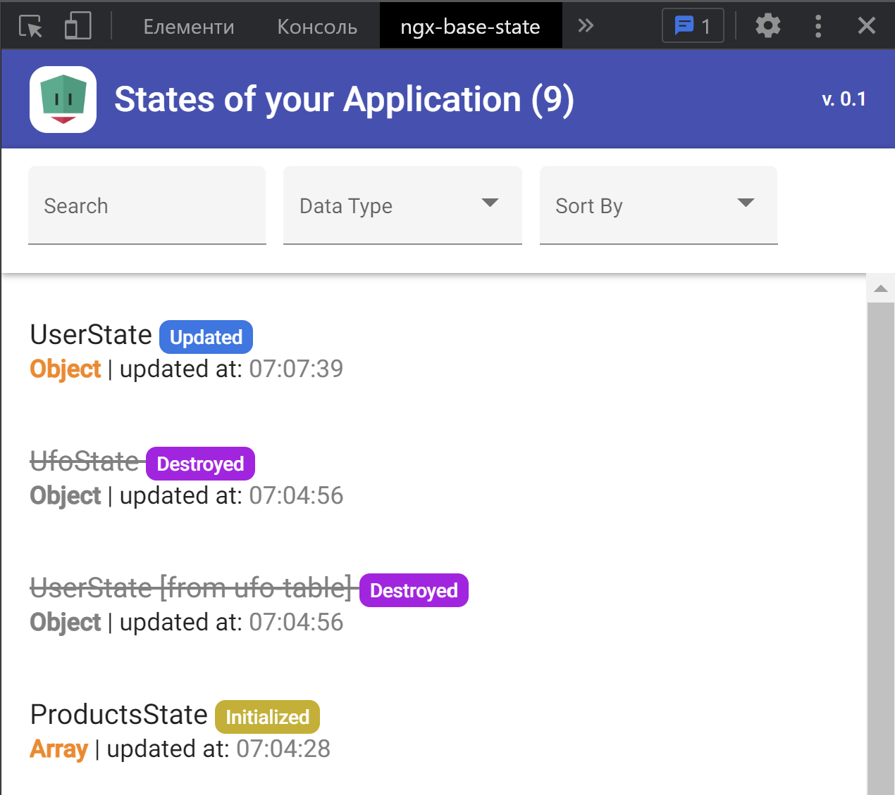
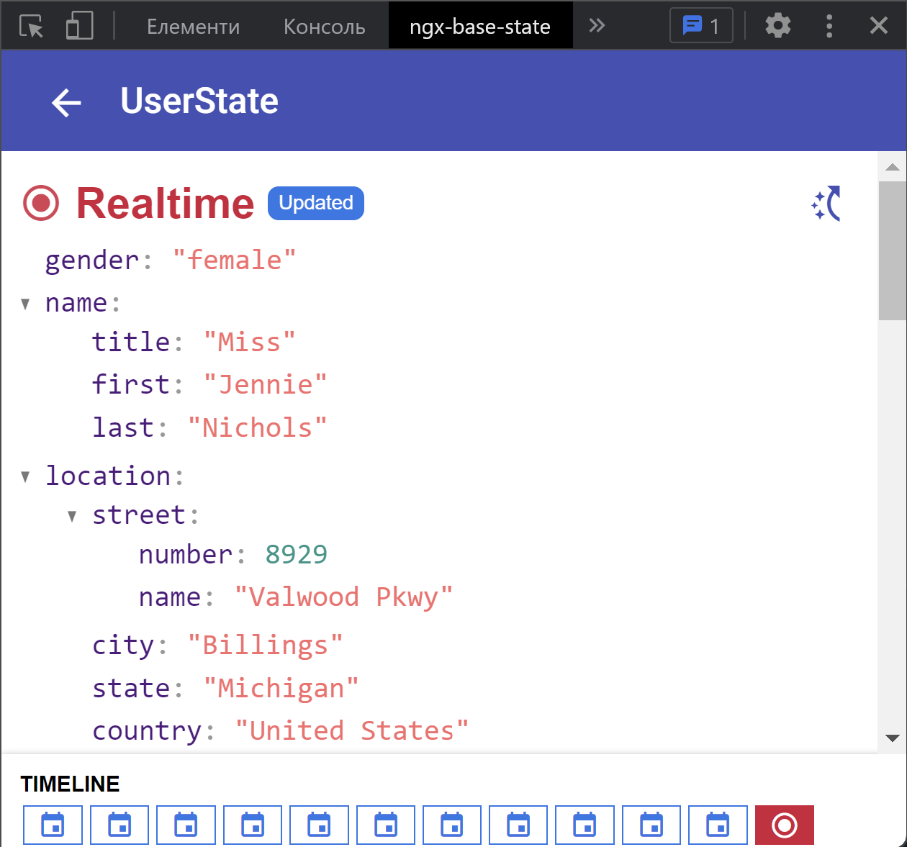

## ngx-base-state 🐍

[]()

[]()
[]()
[](https://travis-ci.org/Nillcon248/ngx-base-state)

### Classes have implemented base work with state

# Idea
The main idea of this library is remove useless code from class.
Usually state services violate [DRY pattern](https://en.wikipedia.org/wiki/Don%27t_repeat_yourself)  
This library will help to create service with state in 2 lines.

# Installation

`npm install ngx-base-state --save`

**OPTIONAL: If you want to use Devtools to explore your state via Chrome Extension:**

### In your AppModule

``` typescript
import {
    NgxBaseStateDevtoolsModule,
    NgxBaseStateDevtoolsConfig,
    NGX_BASE_STATE_DEVTOOLS_CONFIG
} from 'ngx-base-state';
import { environment } from 'src/environments/environment'; 

@NgModule({
    imports: [NgxBaseStateDevtoolsModule],
    providers: [
        {
            provide: NGX_BASE_STATE_DEVTOOLS_CONFIG,
            useValue: new NgxBaseStateDevtoolsConfig({
                isEnabled: !environment.production // Devtools will not work in production
            })
        }
    ]
})
export class AppModule {}
```

## Chrome Extension

This tool allows you to see data in your states based on ngx-base-state.

- Install `ngx-base-state` extension from [Chrome WebStore](https://chrome.google.com/webstore/detail/ngx-base-state/pdilblejagnnejglfodkilcilclmillb);
- Open tab with your Application using ngx-base-state;
- Press F12 to open Devtools;
- Choose ngx-base-state panel in devtools;

Main page will contain list of all your states.
Click to some state and will opened "details page" with state changes history.

List of States                                                                    | Details of concrete State                                                             |
:--------------------------------------------------------------------------------:|:------------------------------------------------------------------------------------: |
  |    |

## Properties

### *State properties*

| Name            | Type                       |  Description                                                        |
|:----------------|:---------------------------|:--------------------------------------------------------------------|
| data$           | Observable<T \| null>      | state data stream                                                   |
| data            | T                          | state data                                                          |

## Methods

### *ObjectState*

| Name              | Arguments                  | Description                                                         |
|:----------------- |:---------------------------|:--------------------------------------------------------------------|
| set               | value: T (generic type)    | set new value for state                                             |
| clear             |                            | clear value for state                                               |
| updateWithPartial | value: Partial\<T\>          | update state by merging current state with new partial value        |

### *ArrayState*

| Name            | Arguments                   | Description                                                                |
|:----------------|:----------------------------|:-------------------------------------------------------------------------- |
| compareItems    | firstItem: T, secondItem: T | **method might be overridden, it used for comparing items in array**       |
| set             | value: T[]                  | set new array for state                                                    |
| addItem         | item: T                     | push new item to array                                                     |
| removeItem      | item: T                     | remove item from array                                                     |
| updateItem      | itemToUpdate: T             | update item in array                                                       |

## Example with ObjectState

*user.state.ts*
``` typescript
import { ObjectState } from 'ngx-base-state';

// So easy to create new State :)
@Injectable({
  providedIn: 'root'
})
class UserState extends ObjectState<User> {}
```

*user.service.ts*
``` typescript
import { User } from '../interfaces';
import { UserApi } from '../api';
import { UserState } from '../states';

// IMPORTANT: Work with states only via "Service" layer.
@Injectable({
  providedIn: 'root'
})
class UserService {
  // Share data for components.
  public readonly data$ = this.userState.data$;

  constructor(
    private readonly userApi: UserApi,
    private readonly userState: UserState
  ) {}

  // Make your methods with business logic, which might affect states.
  // Return Observable. Components can process result by subscribing (complete/next/error).
  public update(): Observable<User> {
    return this.userApi.getCurrent()
      .pipe(
        tap((user) => this.userState.set(user))
      );
  }
}
```

*user.component.ts*
``` typescript
import { ToastService } from '@my-library';
import { UserService } from '@features/user';

// IMPORTANT: Don't inject States directly to components!
// Only services with business logic should know how to affect your states.
@Component({
  selector: 'smart-user',
  template: '{{ user$ | async | json }}',
  styles: ['']
})
class UserComponent implements OnInit {
  // Here is data from our state.
  public readonly user$ = this.userService.data$;

  constructor(
    private readonly userService: UserService,
    private readonly toastService: ToastService
  ) {}

  public ngOnInit(): void {
    this.updateUser();
  }

  // Run some services business logic from the smart component
  private updateUser(): void {
    this.userService.update()
      .pipe(
        catchError(() => this.showErrorToastAboutUserUpdatingError())
      )
      .subscribe();
  }

  // This is task of specific smart components to show UI staff, like: toasts, dialogs, bottomSheets etc...
  private showErrorToastAboutUserUpdatingError(): Observable<unknown> {
    return this.toastService.createError(`Can't update user!`);
  }
}
```

## Example with ArrayState
*users.state.ts*
```js
import { ArrayState } from 'ngx-base-state';

@Injectable({
  providedIn: 'root'
})
class UsersState extends ArrayState<User> {
  constructor() {
    super([]); // Here you can set initial data.
  }

  // ArrayState have base methods to work with array, like: removeItem, updateItem
  // and these methods might compare items in array using some unique value.
  // You can override method `getItemId` if you want operate with items via specific unique value like `id`.
  protected override getItemId(user: User): number {
    return user.id;
  }
}
```

``` typescript
import { UserArrayStateService } from './user.state';

@Component(/* some configuration */)
export class UserTableComponent implements OnInit {
  constructor(
    // Don't inject states directly to components in real projects!
    private readonly usersState: UsersState
  ) {}

  public ngOnInit(): void {
    this.userArrayStateService.data$
      .subscribe(console.log);

    this.setUserArray();  // [{ name: 'Nillcon', id: 248 }, { name: 'noname', id: 1 }]
    this.updateUser()  // [{ name: 'New name', id: 248 }, { name: 'noname', id: 1 }]
    this.removeUser(); // [{ name: 'New name', id: 248 }]
    this.addUser(); // [{ name: 'New name', id: 248 }, { name: 'John Doe', id: 2 }]
  }

  private setUserArray(): void {
    this.userStateService.set([
      {
        name: 'Nillcon',
        id: 248
      },
      {
        name: 'noname',
        id: 1
      }
    ]);
  }

  private updateUser(): void {
    const user = this.userStateService.data[0]; // { name: 'Nillcon', id: 248 }
    user.name = 'New name';

    this.userStateService.updateItem(user);
  }

  private removeUser(): void {
    const user = this.userStateService.data[1]; // { name: 'noname', id: 1 }

    this.userStateService.removeItem(removeItem);
  }

  private addUser(): void {
    this.userStateService.pushItem({
      name: 'John Doe',
      id: 2
    });
  }
}
```
